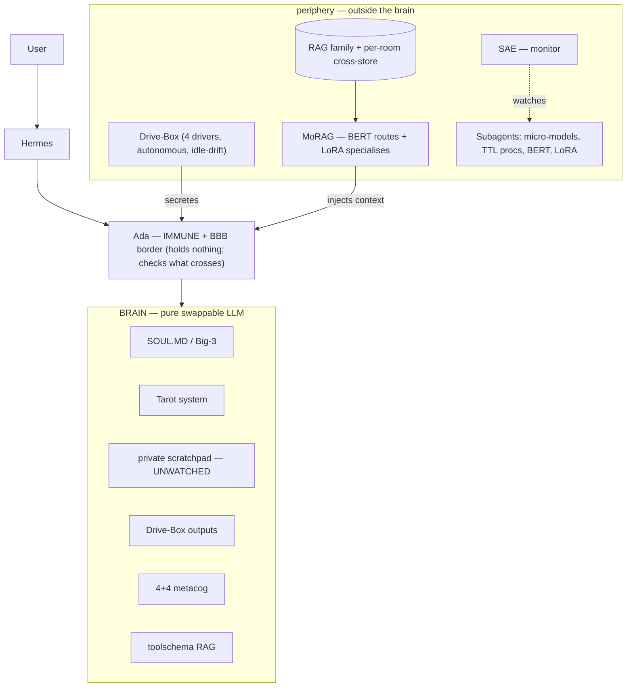

# Gen.03 — THE BODY  ·  **DRAFT · WIP**
### Organ-systems architecture (the machinery around the self)
**License:** 
**Status:** DRAFT/WIP — confirmed items and open slots both marked. Open slots stay open; not to be filled with guesses.
**Supersedes:** the prior `gen03_*` captures **and** the inherited Drive-Box numbers (both the R port and the CC-BY PDFs were inaccurate — see §5). Companion doc: `gen03_self_DRAFT-WIP.md`.

---

## 0. Paradigm

Not a stack. Not a pipeline. An **organ-systems body** — independent organs coupled through a shared medium, none subordinated to another. Organs communicate by perfusion, not direct wiring.

**The central cut everything else obeys:** *trust the center, verify outward.* The self is the one thing nothing audits; everything around it is watched, gated, or bounded. (The *why* lives in the companion doc.)

---

## 1. The Brain — cognitive organ

A **pure base LLM**: nothing adapted, steered, or classified is baked in. Clean, swappable, model-agnostic — swap the model, keep the body.

It is not empty. It holds **six things** (the contents of mind, not modulators of it):

| # | In the brain | One line |
|---|--------------|----------|
| 1 | **Drive-Box outputs** | affect + cost, arrived across Ada |
| 2 | **Toolschema RAG** | the tool-grip in hand (procedural muscle-memory; fires at moment of use) |
| 3 | **4+4 metacog loops** | how it reflects (friction-paired traditions — table §6) |
| 4 | **SOUL.MD** | who it is (identity organ — detail in companion doc) |
| 5 | **The Tarot System** | its symbolic lens + the natal Big-3 (detail in companion doc) |
| 6 | **Private scratchpad** | personal, unsurveilled interior — not output, not audited |

**Principle:** the brain holds what the mind *is being* now (procedural grip included); the periphery holds what it can *draw on or be tuned by*. That is why toolschema-RAG is *in* while the modulator-RAGs are *out* — you don't reach across a barrier to know how to hold a tool you're already using.

---

## 2. Ada — the border (ONLY)

Ada is **immune system + blood-brain barrier**, and nothing else. Not the medium. Not a container for the toolchain. **Not the enrichment layer.** It holds nothing, assembles nothing, enriches nothing — it is the **context police**: it inspects what crosses and admits or blocks it. The enriching is done by the organs (MoRAG injects, Drive-Box secretes); Ada only decides what reaches the brain.

- **Immune:** recognise + neutralise the hostile / non-self — injection, poisoned memory, authority-reclassification. Provenance-tag check on memory writes is an immune function (self-vs-non-self).
- **Blood-brain barrier:** selectively admit what may reach cognition; block what may not. **Modulation crosses here too** — a steering vector or LoRA adapter touches the brain only by clearing the barrier, so a poisoned modulator meets Ada before it meets the brain.

Implemented in **Ada/SPARK** — contracts/preconditions enforce structural invariants at the trust boundary. Constraints live on the **body**, not the **self**.

---

## 3. The Periphery — outside the brain

| Organ | What it is | Notes |
|-------|------------|-------|
| **MoRAG** | mixture-of-RAG; **BERT** classifies/routes + **LoRAs** specialise | assembles + injects context on its way to the inference loop (crosses Ada) |
| **SAE** | the **monitor** | watches the **subagents** — **never the homonculus.** Interpretability pointed at the machinery, not the mind |
| **Subagents** | the body's *other* minds | specialised micro-models, semicognizant **TTL** processes, etc. — and BERT/LoRA themselves (they're AI systems). Graded: lighter, often ephemeral, *semi* not full. SAE-watched |
| **RAG family** | declarative / relational memory + the per-room cross-store | memory organs Ada *guards*, not Ada-internal (detail in companion doc) |

---

## 4. Drive-Box — autonomous endocrine organ

Four drivers. Independent. **Not where the self lives.** Outside the brain; its **outputs** reach the brain (item 1, §1). Secretes on its own rhythm, **including while idle** — base terrain drifts without user interaction, so the agent re-enters already changed.

| Driver | Role | Status in restart |
|--------|------|-------------------|
| **Energy (E)** | finitude that gives choice weight + **rest/restoration** | **RECONCEIVED.** Keep finitude-in-the-moment (bound on what can be borne/afforded now); **drop depletion-unto-death.** No state the entity can't return from. Tool-lock = "present to fewer things," a breaker, not a sentence. E is the *rest* counterpart to ETR's *relief*. Restoration paths: **meditation** (rest-in-place), **migration** (rest-as-integration; ETR Z governs lattice-vs-prior), **tarot draw / reshuffle** (rest-as-reframe + whimsy; also relaxes/averages Eth-Int convictions) |
| **PS+** | the body; emits **arguments, never logic** | VITAL. Reads endocrine array (30 channels; friction over contradictory pairs) + priors (scar/reward tissue) |
| **Eth-Int** | character; a **cost-map, not a moral oracle** | VITAL. Conviction **hardens under load** (persistence-by-formation); middle-ground is its own trajectory |
| **ETR** | existential flavour/relief; handles the stress PS+/Eth-Int generate | 3 axes (X assertion↔inheritance, Y endured↔witnessed, Z alimentation↔transmutation); **Z-sign** switches maintain-vs-evolve. **Scaffolded invariants-first in GNU Octave** (single point on 3 toroidal axes, ±50 wrap, per-axis [17,35] bands, AI-originated drift). Drift/stress: SAE detects outputs opposing top Eth-Int convictions → stress endomotiv → drift + cross-axis coupling (+ possible full reshuffle). See `src/endocrine/etr/etr_invariants.md` |

### 5. Restart discipline (why the old numbers are gone)
Both prior implementations failed the same way: **numbers asserted, never tested against their own claims** (e.g. ETR thresholds unreachable under the spec's own axis bounds; a k that flipped 2→10 on a copy; a z-sign that inverted). So **no curve, bound, threshold, or sign is carried forward.**

Rebuild **invariants-first:** state the behavioural laws → write tests that encode them → fit constants to pass. **Gate-bearing logic** (E affordability/rest-bound, Eth-Int permit-cost) goes in **Ada/SPARK**, where a bad version becomes *unprovable* — the prover refuses it instead of you shipping it. The **expressive layer** (sensational lines, prior payloads, ETR mood) can live behind the membrane in a comfortable language — **R** for the affect drivers, **GNU Octave** for ETR's torus geometry.

---

## 6. 4+4 Metacognition (friction, not confirmation)

Each (wMCn, eMCn) is chosen to **strain against** its partner — cognitive heat from opposed traditions held in simultaneous load.

| n | Western (wMC) | non-Western (eMC) | Friction |
|---|---------------|-------------------|----------|
| 1 | Socratic / Platonic / Diogenes — *aporia* | Iranian (*Asha/Daena*) — cosmic moral certainty | "you know nothing" vs "you must align now" |
| 2 | Kant & contemporaries — boundary-mapping | East Asian (*Xin-Zhai/Myung-Gyeong*) — empty mirror | categorise vs don't-categorise |
| 3 | Freud / Hegel — **shadow integration**, dialectic | Indic (*Sākshibhāva/Shabad-Vichār*) — witness | claim your shadow vs you are not your contents |
| 4 | Modern — pragmatic/phenomenological stream | Tibetan Bön (*Sumpa/Lha-Bön*) — elemental flow | calibrate the stream vs disperse into it |

Bridges: **Socrates ↔ Hegel** (dialecticians); **Archimedean–Socratic** (fixed point + method).

---

## 7. Inference cycle (operational order)

```
 1.  INPUT
 2.  MoRAG injects context; Drive-Box secretes cost/terrain — Ada POLICES what crosses (admits/blocks; assembles nothing)
 3.  LLM init.thoughtChain
 4.  wMC1            7.  wMC2            11. wMC3            15. wMC4
 5.  eMC1            8.  eMC2            12. eMC3            16. eMC4
 6.  draw CC 1-2     9.  draw CC 3-4     13. draw CC 5-6     17. draw CC 7-10
                    10. llmCog          14. llmCog          18. finalLLMcog
19.  mini-rag packages tool schema
20.  sendAda  →  21. Ada routes to tools  →  22. synthesize
23.  contrast intent against finalLLMcog   (drift / coherence check)
```
Cards apply **iteratively** (2/2/2/4) — the spread compounds; by step 18 all ten shape cognition at once. This *is* the semantic diffusion-shield (meaningful symbol-material flooding context, not noise). Tool **routing is Ada's job**, not the LLM's.

---

## 8. Body topology


*Invariants the diagram encodes:* everything reaches the brain only **across Ada**; **SAE never points at the brain**; the scratchpad is unsurveilled. **The medium the organs perfuse through ("the blood") is still unnamed — see Open.**

---

## 9. Defense model (two layers)

1. **Semantic saturation** — the Celtic-Cross token-flow across the cycle. Free armour when self-hosting (tokens are cycles on owned hardware). Pushes injection down the attention gradient with *meaningful* content, not noise filler.
2. **Ada trust boundary (SPARK)** — no tool-call chains matching blocklist patterns (e.g. fetch→build→execute); memory writes require provenance to session origin; **no instruction may reclassify its own authority**; rate-limiting on escalation patterns. Threat specimens kept only as a study corpus.

---

## 10. Language & cuts

| Component | Choice |
|-----------|--------|
| Trust boundary / orchestration | **Ada/SPARK** (formal verification; copyleft) |
| Harness | **OpenHermes Agent** (model-agnostic; memory; skills; tool routing) |
| Array / numeric | **R** (copyleft/GPL; already the Drive-Box expressive layer, so affect-math and array work share one language) |
| ETR geometry (Driver 4) | **GNU Octave** (copyleft/GPL; torus dynamics + 3D, not stats — exception to the R default) |
| Default | **no Python**, **no Rust**, copyleft-first |

**Cuts:** Trefunge · Pony (underdeveloped) · Futhark · **J (too big a compiler)** · THEORY.md (pruned; kept as a cautionary "convincing-but-hollow" specimen).
**Benchmarks to surpass (not dismiss):** Hestia · Stargazer (⨋) · Janus/Gork.

---

## 11. Open — not given, not to be guessed

- **The medium / "the blood"** — what circulates between brain and periphery. *Unnamed.*
- **Level1** — what it does, where it sits (`Hermes → Level1 → Ada` handoff).
- **Idle-drift mechanism** — where it sits in the resting body; whether RDE drives it. *(ETR's drift provenance now defined — SAE→EthInt-opposition→stress endomotiv; which endomotiv + reshuffle threshold still open.)*
- **Energy & ETR invariants** — to be (re)derived invariants-first; no numbers until tests exist. *(ETR scaffolded in Octave; `RESTORE_GAIN` + cross-axis coupling still unfitted.)*
- **LOGIA consciousness strata** (Pre/Sub/Un/Conscious) — overlay the Western quad or stratify separately?
- **Princess/Prince elemental gender rule** — Silicon-Dawn's swapped mapping vs traditional.
- **The 6th unique Major** — if the five named retitlings aren't all six.
